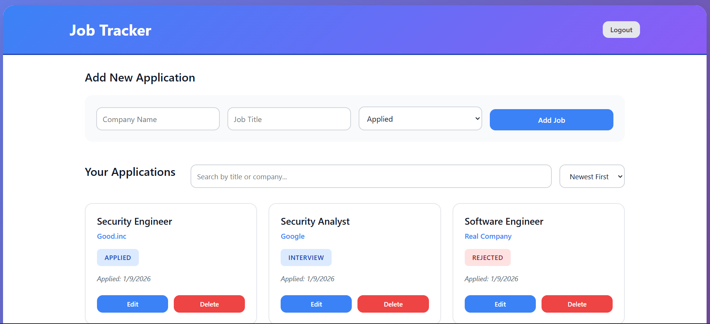
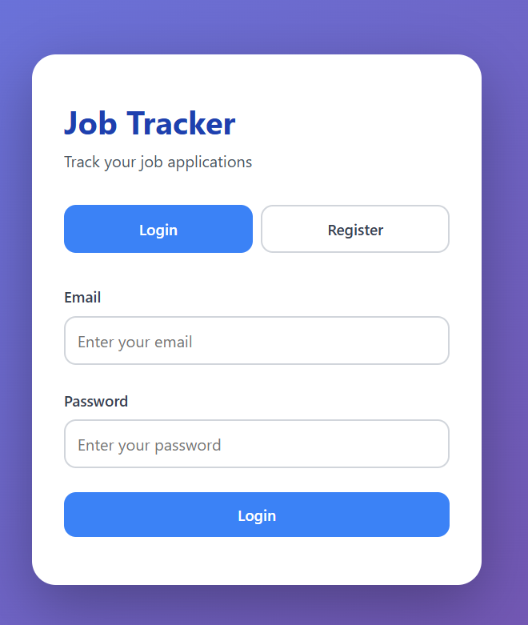

# Job Application Tracker

A full-stack web app to track job applications and manage statuses, notes, and follow-ups. Built with React (Vite), Node.js/Express, and MongoDB.

## Features

- Add, view, edit, and delete job applications
- Track status (Applied, Interview, Rejected, Offer)
- Search and sort applications
- REST API for submitting and fetching jobs
- Frontend built with React + Vite
- Backend built with Node.js + Express
- Stores job data in MongoDB (Mongoose)

## Demo

### App preview

Dashboard:


Login Page:


---

## Email Integration (WIP)

In progress on the `email_parser` branch (not merged to `main` yet):

- Connects to Gmail via IMAP
- Parses unread emails for job application confirmations
- Matches emails using basic keyword filtering (e.g., "thank you for applying", "application received")
- Sends matched entries to the backend and stores them in MongoDB

---

## 🚀 Running It Locally

```bash
# 1. Clone the repo
git clone https://github.com/SeveralFaun/job-tracker.git
cd job-tracker

# 2. Start the backend
node index.js
Server runs at: http://localhost:3000

### 3. Start the frontend
```bash
cd frontend/job-tracker-frontend
npm install
npm run dev
```
App runs at http://localhost:5173
